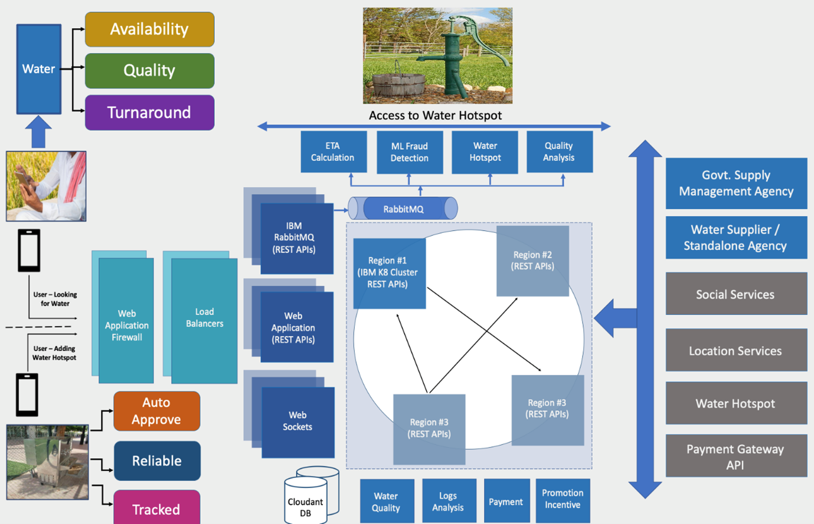

## Blue Safe

## Contents

1. [Value Offered](#value-offered)
1. [Demo video](#demo-video)
1. [The architecture](#the-architecture)
1. [Long description](#long-description)
1. [Roadmap](#roadmap)
1. [UX Design](#ux-design)
1. [Deployment and configuration](#deployment-and-configuration)
1. [Live demo](#live-demo)
1. [Built with](#built-with)
1. [Versioning](#versioning)
1. [Authors](#authors)
1. [License](#license)
1. [Acknowledgments](#acknowledgments)

## Value Offered
Life saver app that enables people in locating, checking water quality and share info about availability and waiting time of the nearby safe water resources

### What is the problem?
Water is the natural resource that is most threatened by climate change and is a prerequisite for life on earth. According to the World Health Organization, 
-	2.2 billion people around the world do not have safely managed drinking water services
-	4.2 billion people do not have safely managed sanitation services and
-	3 billion people lack basic handwashing facilities. 

These services are critical in preventing the spread of COVID-19 and other diseases. Even in areas that have these services, there are vast inequalities in the accessibility, availability, and quality of the services.

### How can technology help?
With this initiative we aim to implement technology to mitigate this predicament that has adversely affected global population.

This application is designed to help search for water resources, navigate to them, and save them as favourites, thereby improving access to these life-saving resources. The app increases awareness, access and use of public water.	 	

Equipped with powerful APIs, sophisticated automation and ease, the application can help people and government in locating various sources for fresh and clean water.

### The idea
To encourage optimal water choices by consumers and local governments and incentivize water sustainability, we propose devising and implementing an application for water data collection and dissemination. The app will give us an opportunity to

-	Access safe drinking water sites and facilitate
      - Viewing available site (within ~5km radius)
      - Viewing waiting time
      - Navigating to the nearest sites 
      - Water availability
      - Adding a new site
      - Approving the site added by end-user.
- Improve water quality 
-	Enable water sanitization
-	Optimize water usage and efficiency
-	Enable weather forecasting (To help plan rainwater storage and other uses)

## Demo Video

### Additional Demo Video
[Click Me To Watch Demo](https://www.dropbox.com/s/rgzqa5whr34rcsa/CFC-2021-BlueSafe.mp4?dl=0)

[Download Here](https://github.com/Hackathon-CFC/BlueSafe-CFC2021/blob/main/tech-docs/CFC-2021-BlueSafe.mp4)

## The architecture

## Long description

### Water sites 

Of the 70% of water that comprises our planet, only 3% is fresh water, and two-thirds of that is frozen in glaciers and unavailable for use. Freshwater is obtained from two sources: surface water and ground water. People use surface and ground water every day for a variety of purposes, including drinking, cooking, and basic hygiene, in addition to recreational, agricultural, and industrial activities. Blue Safe app helps users to identify these water sites and navigate to them.

This identification and navigation to the water sites will ease the access to hygienic drinking water, distribute water usage across water sites, and help to improve sanitisation and hygiene.

There are 2 variants of the Blue Safe app
1.	End user App
2.	Admin App

#### End user App

This helps user in two ways
-	Find and navigate to the nearest water site
-	Add a new water site if they discover any

#### Admin App

The main function of this variant is to,
-	Approve or reject the new added water sites by end users 
-	Monitor available water sources and update their status

Both the app variants have OTP based signup or login page which will allow users to perform their tasks.

### Water Quality Parameters and Standards

The quality of water determines whether it is safe for consumption. Based on the geographical location, proximity to industries, natural contamination and chemical composition, water can easily turn out to be unsafe for drinking. Contaminated water has long been responsible for causing waterborne disease such as cholera, diarrhoea, hepatitis A, and typhoid.

Blue Safe app suggests the water quality based on area or location selected by the user. Our app also, allows users to report their water quality and raise a request to water department to check and treat the water accordingly.

Water quality parameters and their ranges are:
-	pH level (Ranges from 6.5 to 8)
-	TDS (Ranges from 50 to 150)
-	Salinity (Ranges from 600 to 900)

Standards of water quality are presented by colour coding Red, Amber, and Green; where Red is non consumable, Amber is poor quality wherein Green is safe.

In the future, the app will be integrated with the government grievance website or app, and the user will be able to track the status of the request in real-time.

Our app will have new features and are part of our road map. These features are:
-	Water Sanitization
-	Water Usage and Efficiency
-	Weather Forecasting

## Roadmap

## UX design

| Details             | URL |
| ------                     | ------ |
| **User Persona** - We created a user persona to identify the users.             | <a href="https://github.com/deepakb2410/CFC-2021/blob/main/UX_Design/App-Users.pdf">Users</a> |
| **Hills** - Hills are statements of intent written as meaningful user outcomes. They tell you where to go, not how to get there, empowering teams to explore breakthrough ideas without losing sight of the goal.                   | <a href="https://github.com/deepakb2410/CFC-2021/blob/main/UX_Design/Hills.pdf"> Hills </a>|
| **User Flow** - We created user flows to identify the journey of the user.                    | <a href="https://github.com/deepakb2410/CFC-2021/blob/main/UX_Design/App-Flow.png">User Flow </a> |
| **Prototype** - This is a clickable prototype for Mobile App which gives an idea of how a user will interact with the App.              | <a href="https://xd.adobe.com/view/c9116858-6c3b-4e40-a02d-5d8220b009b1-9c42/">Mobile App Screens</a> |
|              | <a href="https://xd.adobe.com/view/55e229a9-1984-4330-b186-45a749f4b55d-00b1/"> Notification Screens </a> |

## Deployment and configuration

| Infrastructure             | Deployment |
| ------                     | ------ |
| Prerequisites              | [Prerequsite.md](https://github.com/deepakb2410/CFC-2021/blob/main/Safe_Water_UI/README.md) |
| Frontend                   | [Frontend.md](https://github.com/deepakb2410/CFC-2021/blob/main/Safe_Water_UI/README.md) |
| Backend                    | [Backend.md](https://github.com/deepakb2410/CFC-2021/blob/main/Safe_Water_Server/README.md) |

To use the solution and existing deployed infrastructure, you can register yourself as a new user or you can use the default credentials saved in our cloudant database placed at respective paths.

## Live demo

APK download link : Download [URL](https://github.com/Hackathon-CFC/BlueSafe-CFC2021/blob/main/BlueSafe.apk)

## Built with

* [Express](https://expressjs.com/) - Fast, unopinionated, minimalist web framework for Node.js
* [React](https://reactjs.org/) - A JavaScript library for building user interfaces
* [React Native](https://reactnative.dev/) - A framework for building native apps using React
* [IBM Cloudant](https://www.ibm.com/in-en/cloud/cloudant) - Cloudant is a non-relational, distributed database cloud-based service based on the Apache-backed CouchDB project and the open source BigCouch project.
* [IBM Watson](https://www.ibm.com/in-en/watson) - Watson is a question-answering computer system capable of answering questions posed in natural language, developed in IBM's DeepQA project.
* [IBM Push Notification](https://www.ibm.com/in-en/cloud/push-notifications) - Push Notifications service provides a unified push capability to send personalized and segmented real-time notifications to mobile and web applications.
* [docker](https://www.docker.com/) - Docker is a set of platform as a service products that uses OS-level virtualization to deliver software in packages called containers.
* [kubernetes](https://kubernetes.io/) - Kubernetes (K8s) is an open-source system for automating deployment, scaling, and management of containerized applications.
 * [Carbon Design System - IBM](https://www.carbondesignsystem.com/) - Design Language used for whole project

## Versioning
"Blue Safe" Call for Code submission for July 2021 is available under git tag v1.0.0.0

## Authors

- Deepak Bammi
- Jayant Sharma
- Ravikant Singh Kushwaha
- Aakash Ahuja
- Chandresh Tiwari

## License

Proprietary. The code is submitted on a “as is” basis for the sole purpose of “Call for code 2021” challenge participation

## Acknowledgments

* [Express](https://expressjs.com/) - Fast, unopinionated, minimalist web framework for Node.js
* [React](https://reactjs.org/) - A JavaScript library for building user interfaces
* [React Native](https://reactnative.dev/) - A framework for building native apps using React
* [IBM Cloudant](https://www.ibm.com/in-en/cloud/cloudant) - Cloudant is a non-relational, distributed database cloud-based service based on the Apache-backed CouchDB project and the open source BigCouch project.
* [IBM Watson](https://www.ibm.com/in-en/watson) - Watson is a question-answering computer system capable of answering questions posed in natural language, developed in IBM's DeepQA project.
* [IBM Push Notification](https://www.ibm.com/in-en/cloud/push-notifications) - Push Notifications service provides a unified push capability to send personalized and segmented real-time notifications to mobile and web applications.
* [docker](https://www.docker.com/) - Docker is a set of platform as a service products that uses OS-level virtualization to deliver software in packages called containers.
* [kubernetes](https://kubernetes.io/) - Kubernetes (K8s) is an open-source system for automating deployment, scaling, and management of containerized applications.
 * [Carbon Design System - IBM](https://www.carbondesignsystem.com/) - Design Language used for whole project
